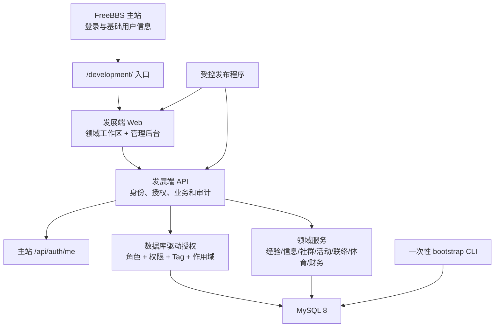

# FreeBBS 发展端生产闭环设计

> 状态：已获方向批准，待书面规格复核
>
> 日期：2026-07-23
>
> 目标：把当前可运行 MVP 补齐为入口、身份、权限、业务后台、数据库和服务器发布均可验证的完整交互版本。

## 1. 背景与完成定义

当前分支已经具备 React 应用外壳、版本化 API、MySQL 存储、九个页面、基础授权模型、部署配置和自动化测试，但需求级审计发现生产自举、动态授权、若干业务管理动作、主站登录回跳和服务器发布仍未闭环。

本阶段完成后必须同时满足：

1. 主站左侧导航可以进入 `/development/`，登录后安全回到原发展端页面。
2. 九个页面不是占位页；每个领域的主要创建、编辑、状态流转和归档动作均可在浏览器完成。
3. 生产空库可以通过受控、一次性的命令创建首位最高管理员和平台基础定义，不依赖演示 seed 或直接改表。
4. 角色、权限绑定、Tag 定义、作用域、有效期、模块负责人和模块状态可以由最高管理员通过受审计 API 管理，并真实参与服务端授权。
5. 日常业务管理通过 `/development/admin` 及各领域页面完成；原始数据库入口只用于经批准的迁移、备份、恢复和排障。
6. 仓库交付服务器安装与原子发布程序；发布失败可切回上一版本，健康检查真实验证 MySQL。
7. 主页面和发展端在品牌、字体、色彩、层级和响应式行为上具有可辨认的一致性，并经过桌面、平板和手机视觉验收。
8. README 和运维文档给出可复制的数据库、GitHub environment、服务器和首发流程，不提交任何真实凭据。

## 2. 方案比较与决定

### 2.1 方案 A：统一业务管理后台（采用）

最高管理员在统一后台管理平台治理对象，并可进入各领域管理视图；普通业务负责人仍在所属领域页面完成日常工作。所有写操作经过版本化 API、作用域校验和审计。Adminer 仅通过回环地址和 SSH 隧道临时开放。

优点是安全边界统一、交接成本低、适合唯一核心开发者维护；代价是需要补齐治理 API 和多组管理交互。

### 2.2 方案 B：完全分散式管理（不采用）

平台后台只管理模块和身份，各领域自行建设全部管理页。并行开发自由度高，但首版会产生权限、审计和交互不一致，核心开发者仍需处理跨模块故障。

### 2.3 方案 C：以 Adminer 为主要后台（不采用）

开发量低，但会绕过服务端校验、事务、作用域和审计，也会把数据库凭据扩散给业务人员，不满足生产安全与长期维护要求。

## 3. 总体架构

主站仍是认证权威；发展端只保存主站 UID 与发展端授权。浏览器读取主站同源 `free_bbs_auth_token`，发展端 API 把 Bearer Token 转给主站核验，再从本库加载有效角色、Tag、作用域和权限。前端只负责呈现，所有权限最终由 API 决定。

## 4. 生产自举

新增 `npm run admin:bootstrap -- --uid <主站UID> --confirm "BOOTSTRAP_SUPER_ADMIN:<主站UID>"`。确认串必须与同一条命令中的 UID 完全一致。该命令只在 `NODE_ENV=production`、`DATA_MODE=mysql`、迁移完成且显式确认时运行，并使用迁移级数据库凭据。

自举事务负责：

- 幂等写入全部内置角色、权限、角色权限绑定、Tag 定义和九个模块记录；
- 建立主站 UID 对应的 subject，首次显示名使用 UID，用户第一次通过主站认证后再同步正式显示名和头像；
- 授予 `platform.super_admin`；
- 记录不可变审计事件，包含目标 UID、执行时间和版本，不记录凭据；
- 若库中已经存在最高管理员，则默认拒绝。灾难恢复时必须额外传入 `--recovery` 和确认串 `RECOVER_SUPER_ADMIN:<主站UID>`，并记录独立的高风险审计事件。

命令不接受密码、Token 或任意 SQL，不创建主站账号，不导入 demo 业务数据。首位管理员随后必须在 Web 后台完成其余授权。

## 5. 数据库驱动权限

### 5.1 权威数据

`roles`、`permissions`、`role_permissions`、`role_assignments`、`tag_definitions`、`tag_permissions`、`tag_assignments`、`module_owners` 和 `modules` 成为运行时权威。新增 `tag_permissions` 表，使扩展 Tag 通过显式动作、资源、作用域和 effect 绑定获得能力。代码中的权限目录只用于校验允许的动作/资源组合和生成内置模板，不再直接替代数据库绑定。

每次认证加载：

- 当前有效且未过期的角色分配；
- 角色对应且启用的权限规则；
- 当前有效的 Tag、作用域和有效期；
- 模块启用状态。

删除或停用定义后，新请求立即失去对应能力。服务端默认拒绝未知角色、未知权限、未知 Tag、错误作用域和过期分配。

### 5.2 角色与 Tag

内置角色覆盖最高权限、四类负责人、四类部长/主任、四类部员、团委、科协；普通同学继续由基础身份 `student` 表示。内置 key 不允许重命名或删除，但其启用状态和权限绑定可受控调整。

`sports.team_captain` 保持并列 Tag，必须绑定具体 `sports_team`。其他 Tag 通过定义表注册命名空间、说明、允许作用域类型和 `tag_permissions` 规则，不允许未注册 Tag 产生能力。显式 deny、较具体作用域和过期状态继续遵守统一授权器的优先级，不在 Tag 分支另造一套判断逻辑。

### 5.3 管理 API

最高管理员可通过受审计 API：

- 查询已出现的主站用户映射；
- 授予、撤销角色和 Tag，并设置作用域及有效期；
- 查询角色、权限和绑定；调整允许配置的绑定；
- 注册、停用和更新扩展 Tag 定义；
- 设置模块负责人和模块启用状态；
- 查询带筛选、分页和详情的审计日志。

系统禁止撤销最后一位有效最高管理员，禁止给队长 Tag 使用通配作用域，禁止通过自定义 Tag 获得未登记权限。

## 6. 完整业务交互

工作台负责概览和入口；其余领域至少补齐以下浏览器操作：

| 领域 | 普通使用 | 管理使用 |
| --- | --- | --- |
| 经验库 | 浏览、检索、查看已发布内容 | 新建、编辑、发布、撤回、归档，维护类别与适用范围 |
| 信息与咨询 | 阅读公告、提交咨询、查看本人进度 | 新建/编辑/发布公告，分派咨询，更新状态和答复 |
| 社群与俱乐部 | 浏览、申请加入、退出 | 创建、编辑、归档俱乐部，审批成员与关联活动 |
| 活动 | 浏览、报名、取消报名 | 创建、编辑、提交审批、批准/驳回、发布、结束、归档 |
| 联络资源 | 按权限浏览和检索 | 新建、编辑、调整可见范围、归档，并记录敏感读取 |
| 体育代表队 | 浏览本队信息、队长打卡 | 创建/编辑队伍、维护成员和队长、查看签到记录 |
| 财务治理 | 查看获授权记录 | 创建预算/决算、提交审批、批准/驳回、关联活动、归档 |
| 权限与模块管理 | 无普通入口 | 管理用户映射、角色、权限、Tag、模块负责人、模块状态和审计 |

状态流转由服务端显式状态机验证，不能由客户端任意写字符串。团委审批和科协技术支持权限必须至少绑定一个真实 API 动作和页面入口，不能保留为“死权限”。删除优先采用归档；涉及引用的数据不做物理删除。

首版状态机固定为：

- 经验与公告：`draft -> published -> archived`，已发布内容可撤回到 `draft`；
- 咨询：`open -> in_progress -> resolved -> closed`，关闭前允许从 `resolved` 退回 `in_progress`；
- 俱乐部、联络资源和代表队：`active -> archived`，恢复操作为 `archived -> active`；
- 活动：`draft -> pending -> approved|rejected`，批准后可 `published -> finished -> archived`，驳回后回到 `draft` 修改；
- 财务记录：`draft -> submitted -> approved|rejected -> archived`，驳回后回到 `draft` 修改。

任何越级转换返回 409，并在审计中记录尝试的来源状态、目标状态和操作者。

## 7. 管理后台信息架构

`/development/admin` 使用分区导航：

1. 用户与授权；
2. 角色与权限；
3. Tag 定义；
4. 模块与负责人；
5. 业务数据入口；
6. 审计日志；
7. 系统状态。

复杂业务记录仍在领域页面编辑，后台“业务数据入口”提供总览、筛选、异常状态和跳转，避免重复实现两套编辑器。表单展示中文名称，同时保留只读内部 key 便于排障。所有危险操作使用确认对话框并展示作用域和影响对象。

## 8. 主站入口与登录闭环

主站导航项继续位于“设置”上方，目标统一为 `/development/`。主站登录页读取 `returnTo`，仅接受同源、以 `/` 开头且不以 `//` 开头的允许路径；不合法值回退 `/`。发展端登录链接携带当前 `/development/...` 路径而非固定首页，登录后恢复原页面。

Nginx 的 `/development/` location 在主站应用路由之前接管请求；部署时先发布发展端静态/API，再合并并发布主站入口，避免先出现可点击但不可用的入口。

## 9. 视觉与响应式

发展端保持信息密度更高的工作台结构，但复用主站的品牌标识、Syne 与 Noto Serif SC 字体、深色渐变/玻璃质感、圆角和交互节奏。新增共享字体加载和明确的设计 token 映射，不复制主站整份 CSS。

页面在 1440、900 和 390 像素宽度下验收。管理长表单、联络卡片、体育队伍、财务表格等复杂页面必须逐页验证无横向溢出、遮挡或不可达操作。若不需要表达新业务概念，不额外生成位图素材；图标继续使用仓库内 SVG 体系。

## 10. 发布与运行时健康

仓库交付可审计的服务器发布程序及安装说明。程序接收 commit SHA 与归档路径，校验二者一致、拒绝路径穿越，解压到新的版本目录，安装锁定依赖、生成生产构建、原子切换 `current`，安装静态文件，执行 `nginx -t`，重启 API、重载 Nginx并执行健康检查；任一步失败均切回上一版本。发布程序不运行 demo seed，也不把凭据写入日志。

API 新增可配置监听地址；生产默认 `127.0.0.1`。健康检查分为：

- `/health`：进程存活，不访问敏感依赖；
- `/ready`：验证迁移状态和真实 MySQL 查询，数据库不可用时返回 503。

部署门禁使用 `/ready`。GitHub Actions 继续把 SSH/数据库 secrets 限定在所需步骤，并在文档中明确 GitHub-hosted runner 访问私网数据库的方案：优先使用服务器本地迁移命令或受控 self-hosted runner，不要求公开 3306。

## 11. 数据完整性与运维

新增迁移为关键引用关系建立兼容现有数据的外键或等价约束；无法安全建立外键的跨域引用必须在同一事务内检查并有回归测试。迁移在真实 MySQL 8 容器中执行空库、重复运行和 CRUD 冒烟测试。

运行时、迁移和备份使用三套最小权限账号。备份脚本继续拒绝覆盖并避免明文密码进入 argv；文档补充 systemd timer/cron 示例、保留策略配置点、异地加密复制和定期隔离恢复演练。Adminer 只能 opt-in、绑定 `127.0.0.1` 并经 SSH 隧道访问。

## 12. 错误处理与审计

API 保持统一 envelope 和 `X-Request-Id`。验证错误返回 400，未登录 401，权限不足 403，不存在 404，冲突 409，模块停用或依赖不可用 503。生产响应不返回堆栈、SQL、Token 或数据库连接信息。

角色、Tag、模块、业务状态、财务、敏感联络读取、bootstrap、迁移和发布均产生可关联的审计或运维记录。审计详情使用结构化字段并对敏感值脱敏。

## 13. 验证策略

采用测试驱动实现，每个行为先出现预期失败再写生产代码。最终门禁包括：

- 权限目录、数据库绑定、过期/作用域和最后管理员保护测试；
- bootstrap 空库、重复运行、错误确认串和审计测试；
- 全部领域 API 状态流转与越权回归；
- 真实 MySQL 8 迁移、外键、仓储和 readiness 集成测试；
- 九个页面主要读写流程的 Playwright E2E；
- 九个页面三种视口的布局检查和关键页面截图复核；
- 主站 `returnTo` 安全回跳和共享 Token 契约测试；
- 发布程序路径、SHA、原子切换、失败回滚和 secret 泄漏测试；
- Docker build、Compose config、Nginx config 和 systemd 静态检查；
- `npm run check`、依赖审计和生产构建。

真实生产验收还需部署负责人提供域名、TLS、服务器 SSH、MySQL 凭据、首位管理员 UID 和 GitHub environment 配置。没有这些外部值时，可以证明发布包和流程可执行，但不能声称线上已经部署。

## 14. 实施分解

实现按以下依赖顺序进行，任务之间设置独立评审：

1. 生产基础定义与一次性管理员 bootstrap；
2. 数据库驱动权限和治理 API；
3. 完整管理后台；
4. 各领域缺失的业务状态和浏览器交互；
5. 主站安全回跳与入口集成；
6. 视觉一致性和全页面响应式验收；
7. 发布程序、readiness、MySQL 集成和运维文档；
8. 全量 E2E、完成审计、分支集成和服务器首发。

各领域可由子 Agent 分别审查或实现独立任务，但同一工作树中会修改共享契约的实现任务不得并行写入。平台核心、权限和部署变更必须先于依赖它们的领域任务合并。
